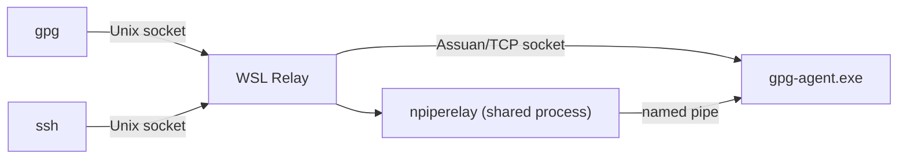
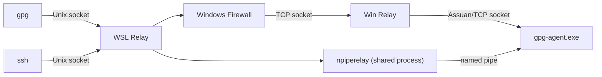
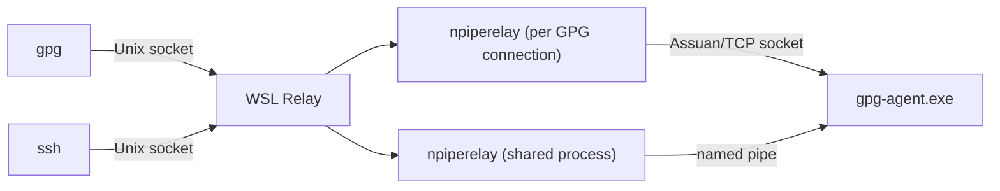

# GPG Relay for WSL1 and WSL2, written in Go

This utility forwards requests from gpg clients in WSL1 and WSL2 to
[Gpg4win](https://gpg4win.org/)'s gpg-agent.exe in Windows. It can also
forward ssh requests to gpg-agent.exe, when using a PGP key for ssh
authentication. It is especially useful when you store your PGP key on a
Yubikey, since WSL cannot share access to USB devices with Windows.

### GPG Access Modes

The WSL Relay supports three modes, selected with `--mode`:

**Direct access for WSL1 or WSL2 with mirrored networking** (`mirrored`):



WSL1 and WSL2 with mirrored networking can connect to gpg-agent.exe on 127.0.0.1 directly,
so no firewall changes or Win Relay are needed.

**WSL2 with NAT networking** (`nat`):



WSL2 in NAT mode has a different IP address than the Windows host, so
network traffic to Windows is external (public). The Win Relay must listen
on `0.0.0.0` and the three GPG ports must be proxied. A firewall rule
is required for the three GPG ports (see [Firewall and Security](#firewall-and-security)).

**npiperelay** (`npiperelay`):



This mode works in any WSL variant when Windows executable interop is
enabled. It does not need the Win Relay or a Windows Firewall rule. It
starts one `npiperelay` process per GPG client connection.

### Access Modes

- **Direct GPG access** (WSL1, WSL2 mirrored): The WSL Relay connects to
  Gpg4win's Assuan sockets.
- **GPG access using TCP relay** (WSL2 NAT): The WSL Relay connects to the Win Relay
  over TCP. The Win Relay connects to Gpg4win's Assuan sockets.
- **GPG access through npiperelay** (`npiperelay`): The WSL Relay starts
  `npiperelay` on the Windows Assuan socket path for each GPG connection.
- **SSH access** (all modes): The WSL Relay multiplexes all SSH client requests through one `npiperelay`
  process for Gpg4win's `//./pipe/openssh-ssh-agent`.

### Authentication

To prevent unauthorized access to the Win Relay in WSL2 NAT mode, a nonce-based authentication scheme is used.
The Win Relay generates a random 16-byte nonce and stores it in a file.
The WSL Relay reads the nonce from the file and sends it when connecting.
The Win Relay rejects connections with an incorrect nonce.

## Architecture

This solution consists of two relay components:

- **WSL Relay** (`gpg_relay_wsl`): Runs in WSL. Receives GPG and SSH
  requests through local Unix sockets. It connects GPG traffic to Gpg4win
  directly, through the Win Relay, or through `npiperelay`.
- **Win Relay** (`gpg_relay_win.exe`): Runs in Windows only for WSL2 NAT
  mode. Receives GPG requests over TCP and forwards them to Gpg4win.

Both executables share Go relay code in `internal/relay`.

Gpg4win's GPG Assuan socket files contain a TCP port and a nonce used
to authenticate the connection. WSL1 and WSL2 mirrored mode can use
these sockets directly. WSL2 NAT mode uses the Win Relay for GPG traffic.
The `npiperelay` mode opens the Windows Assuan sockets through a Windows
process, independent of the WSL networking mode.

For SSH, the WSL Relay starts one `npiperelay` when the first client connects. It queues
length-prefixed SSH agent requests from all clients and forwards one request
and response at a time. It stops the shared process after 60 seconds without
a request, measured from the last completed response. The next request starts
a new process. SSH traffic never passes through the Win Relay.
 Gpg4win's gpg-agent must be configured with `enable-ssh-support` and
 `enable-win32-openssh-support`.

## Firewall and Security

### Firewall Rules

The **mirrored** mode connects to 127.0.0.1 in Windows from WSL1 or WSL2 with mirrored networking.
The **npiperelay** mode runs a Windows process to connect to the local
Assuan socket. None of these modes requires a firewall change.

**WSL2 NAT** mode requires a Windows Firewall rule to allow incoming
connections to the Win Relay. A firewall rule must allow incoming connections
to `gpg_relay_win.exe` on the three configured ports.

Specifically, add an incoming rule for the Public profile that allows
connections from `172.16.0.0/12` and `192.168.0.0/16` to TCP ports
`6910-6912` (or the three ports starting at the custom `--port`).

The private IP address ranges listed above are used by WSL2, but probably
also by computers on your local LAN. To limit access to the Win Relay, a
simple nonce authentication scheme similar to Assuan sockets is used. The
Win Relay stores a nonce in a file that should only be accessible by the
user. By default it saves the file in the GPG home directory in Windows.
The WSL Relay reads the nonce from the file and sends it to the Win Relay
to authenticate.

This ensures that only local processes that can read the nonce file can
authenticate with the Win Relay. Other connections will fail, which means
that connections from other computers on the LAN will be rejected.

## Building

Build from this directory with Go 1.22 or newer:

```bash
make gpg_relay_wsl gpg_relay_win.exe
make test
```

The Makefile cross-compiles the Linux amd64 WSL executable and Windows amd64
executable. Copy `gpg_relay_wsl` to a path in WSL (for example,
`/usr/local/bin/gpg_relay_wsl`) and `gpg_relay_win.exe` to Windows. Gpg4win
and its `gpgconf.exe`, `gpg-connect-agent.exe`, and `gpg-agent.exe` must be
available on the Windows PATH. WSL needs access to `gpgconf.exe`. Direct
modes also invoke `gpgconf` to locate local socket paths and `wslpath` to
convert Windows paths; NAT mode uses `wslpath` when deriving the default
nonce file path. The `npiperelay` mode passes Windows socket paths unchanged.

For SSH support or `npiperelay` GPG mode, install a current release of
[albertony's npiperelay fork](https://github.com/albertony/npiperelay/releases)
in Windows. This fork supports the `-a` Assuan socket option; the original
`jstarks/npiperelay` release does not. Create a WSL symlink at
`/usr/local/bin/npiperelay` pointing to `npiperelay.exe` and ensure
`/usr/local/bin` is on the WSL Relay's `PATH`, including when started
by systemd. The relay reports an error at startup if `npiperelay` is
required and cannot be found. Windows executable interop must be enabled.

### WSL Relay

```bash
gpg_relay_wsl --help
```

The Go executable uses long flags with a single or double leading dash.
Supported flags are `--mode`, `--enable-ssh-support`, `--remote-address`,
`--port`, `--noncefile`, `--logfile`, `--pidfile`, `--systemd`, and
`--log-level`. Defaults are mirrored mode, port 6910, SSH disabled, and WARN
logging. The default remote address is the NAT gateway in NAT mode and
127.0.0.1 otherwise; an explicit `--remote-address` takes precedence.
The `npiperelay` mode does not use the remote address.

### Win Relay

```bash
gpg_relay_win.exe --help
```

Start `gpg_relay_win.exe` independently on Windows for NAT mode. It listens
for GPG traffic on the three ports beginning at `--port` (default 6910).
Its flags are `--port`, `--noncefile`, `--log-level`, `--windows-address`,
`--windows-logfile`, and `--windows-pidfile`. The default listening address
is 127.0.0.1; use `--windows-address=0.0.0.0` for WSL2 NAT traffic and
configure the Windows firewall as described below. The nonce file defaults
to `gpg_relay.nonce` in the Windows GPG home directory.

### Mode Selection

- **`nat`**: Use this mode when WSL2 is configured with NAT networking.
  Requires a Windows Firewall rule (see [Firewall and Security](#firewall-and-security)).
- **`mirrored`** (default): Use this mode when running in WSL1 or when WSL2 is configured
  with mirrored networking. No firewall changes or Win Relay are needed.
- **`npiperelay`**: Use this mode with any WSL networking configuration to
  reach GPG through Windows executable interop. No Win Relay is needed.

When the mode is set to `nat`, the remote address is automatically
detected from the default gateway. In `mirrored` mode,
it defaults to `127.0.0.1`. An explicit `--remote-address` takes precedence.

## Systemd Socket Activation

The recommended way to run the WSL Relay is via systemd socket activation. This
eliminates the need for manual startup scripts and provides better startup
ordering and resource management.

The [systemd](systemd) folder contains examples of running gpg_relay_wsl under systemd.
You will need to update the `ExecStart` command with the command to run.


### Installation

1. Copy the systemd unit files to your user systemd directory:

   ```bash
   mkdir -p ~/.config/systemd/user
   cp systemd/*.socket systemd/*.service ~/.config/systemd/user/
   ```

2. Reload the systemd user daemon:

   ```bash
   systemctl --user daemon-reload
   ```

3. Enable the socket units:

   ```bash
   systemctl --user enable --now gpg-relay-agent-socket.socket gpg-relay-agent-extra-socket.socket gpg-relay-agent-browser-socket.socket gpg-relay-agent-ssh-socket.socket
   ```

4. You may need to mask the gpg-agent service and socket units:

   ```bash
   systemctl --user mask gpg-agent.service gpg-agent.socket gpg-agent-browser.socket gpg-agent-extra.socket gpg-agent-ssh.socket
   ```

The service will now automatically start when any of the GPG sockets are
accessed. The four sockets are:

- `S.gpg-agent` - Main GPG agent socket
- `S.gpg-agent.browser` - Browser GPG agent socket
- `S.gpg-agent.extra` - Extra GPG agent socket
- `S.gpg-agent.ssh` - SSH GPG agent socket

### Configuration

The systemd service file can be customized by creating a drop-in override:

```bash
systemctl --user edit gpg-relay-agent.service
```

For example, to change the access mode or enable SSH support:

```ini
[Service]
ExecStart=/usr/local/bin/gpg_relay_wsl --systemd --enable-ssh-support --mode=mirrored
```

## A note about gpg-agent.exe and its support for SSH

1. The ssh Assuan port does not appear to work. gpg-agent.exe closes the connection immediately after receiving the request.

2. The PuTTY Pageant protocol works, but requires getting a handle on a hidden window, which requires a program to be running in Windows. It cannot be done from WSL.

3. `enable-win32-openssh-support` instructs gpg-agent.exe to create the
Windows Named Pipe, which can be used
to handle ssh-agent requests with the help of npiperelay. However, the
implementation appears to be limited: gpg-agent.exe cannot handle multiple
simultaneous requests. If multiple npiperelay processes are started at the
same time, most of them will fail to connect with "pipe busy" errors, and
gpg-agent.exe does not appear to recover. The solution to this is to keep
one single npiperelay process running that can multiplex SSH requests from
multiple clients and return the responses.

## Tips when using Remote Desktop

If you are using RDP to a remote host, RDP can redirect the local Yubikey
smartcard to the remote host, so that the remote gpg-agent.exe can access
it.

Sometimes the Yubikey smartcard will be blocked on the local host so that
the remote host cannot access it. When that happens the solution is to
remove the Yubikey and insert it again, while an RDP session is active.
This allows RDP to grab the smartcard.

An alternative to re-inserting the Yubikey is to restart some local
services to free the Yubikey for use on the remote host. The
[rdp_yubikey.cmd](../utils/rdp_yubikey.cmd) batch command automates stopping
and/or restarting local processes. It must be run as Administrator.
